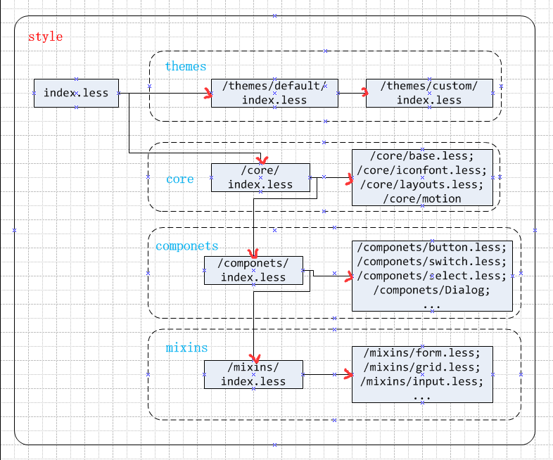

# ant-design 样式库

## 引入样式

import 'antd/lib/index.css';  
或者  import 'antd/style/index.less'

**注意：**如果要修改ant-design的样式和主题，一定要引入 antd/style/index.less 文件，而不是默认的 antd/lib/index.css 文件

## antd/style目录说明

antd/style 是 ant-design 的样式库，它里面包含四个目录 
                                   
- components  (定义所有组件样式)                    
- core  (定义全局样式)                       
- mixins  (less mixins)                         
- themes  (皮肤)   

它们之间的关系如图:                             
  
                    
## 改变样式主色系
[修改 Ant Design 的主色系](https://github.com/ant-design/antd-init/tree/master/examples/customize-antd-theme)


# less
Less 是一门 CSS 预处理语言，它扩展了 CSS 语言，增加了变量、Mixin、函数等特性，使 CSS 更易维护和扩展。

## 相关资料
[Less 中文网](http://lesscss.cn/)                   
[Less 简介](http://www.bootcss.com/p/lesscss/)                         
[Less 入门](http://www.cnblogs.com/fsjohnhuang/p/4187675.html)                          

## 浏览器端用法
在引入less.js前先要把你的样式文件引入 :
```
<link rel="stylesheet/less" type="text/css" href="styles.less">
<script src="less.js" type="text/javascript"></script>
```

## 服务器端安装和使用         
安装：                                                    
```
npm install -g less
```
在命令行下使用：                              
```
lessc styles.less
```                                     

## 语法简介
变量：变量允许我们单独定义一系列通用的样式，然后在需要的时候去调用。所以在做全局样式调整的时候我们可能只需要修改几行代码就可以了。
```
@color: #4D926F;
#header {
  color: @color;
}
```
混合：混合可以将一个定义好的class A轻松的引入到另一个class B中，从而简单实现class B继承class A中的所有属性。我们还可以带参数地调用，就像使用函数一样。                                           
```
.rounded-corners (@radius: 5px) {
  border-radius: @radius;
  -webkit-border-radius: @radius;
  -moz-border-radius: @radius;
}
#header {
  .rounded-corners;
}
#footer {
  .rounded-corners(10px);
}
```
嵌套规则：我们可以在一个选择器中嵌套另一个选择器来实现继承，这样很大程度减少了代码量，并且代码看起来更加的清晰。                                                              
```
#header {
  h1 {
    font-size: 26px;
    font-weight: bold;
  }
  p { font-size: 12px;
    a { text-decoration: none;
      &:hover { border-width: 1px }
    }
  }
}
```
函数运算：运算提供了加，减，乘，除操作；我们可以做属性值和颜色的运算，这样就可以实现属性值之间的复杂关系。LESS中的函数一一映射了JavaScript代码，可以操作属性值。                                  
```
@the-border: 1px;
@base-color: #111;
@red:        #842210;
#header {
  color: @base-color * 3;
  border-left: @the-border;
  border-right: @the-border * 2;
}
#footer { 
  color: @base-color + #003300;
  border-color: desaturate(@red, 10%);
}
```              
## 相关知识
&符号用法：在 [Less 入门](http://www.cnblogs.com/fsjohnhuang/p/4187675.html) 中 4. 父选择器引用（ParentSelector）中介绍的比较详细                                       
伪类：[伪类介绍](http://www.w3school.com.cn/css/css_pseudo_classes.asp)                      
伪元素：[伪元素介绍](http://www.w3school.com.cn/css/css_pseudo_elements.asp)
